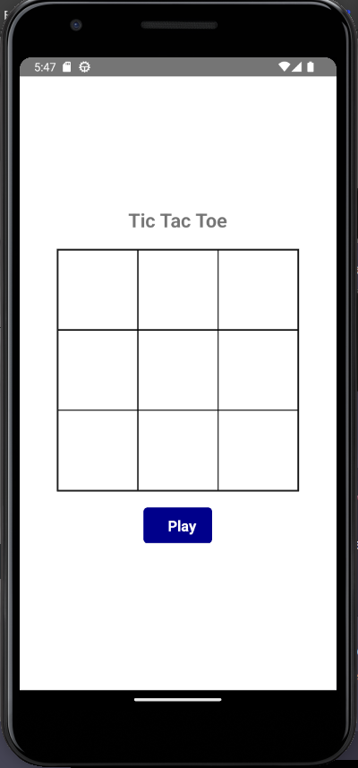
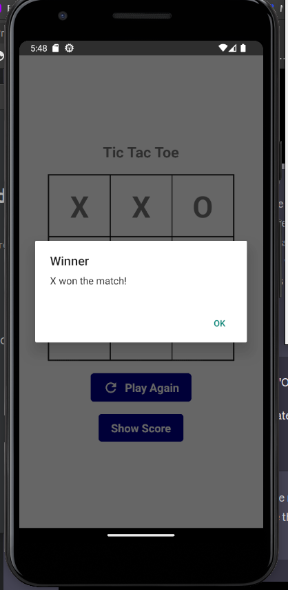
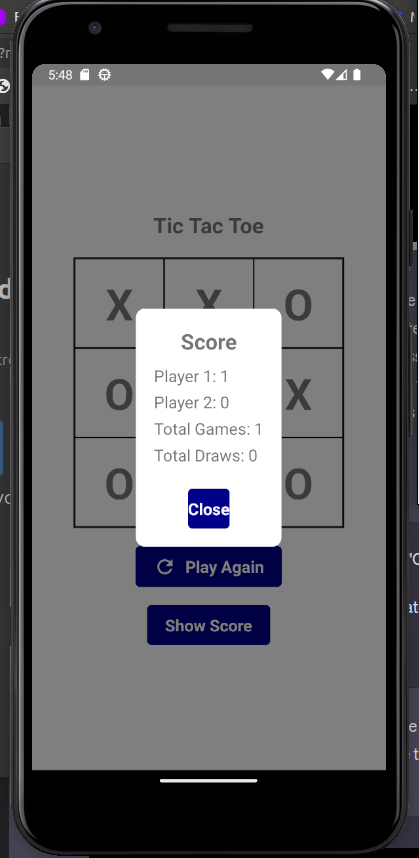

# Tic-tac-toe Game
```
This is a simple Tic-tac-toe game implemented in React Native using TypeScript. It allows two players to play the game on a 3x3 grid. The players take turns marking cells with their respective symbols ('X' and 'O'), and the first player to get three of their symbols in a row (horizontally, vertically, or diagonally) wins the game. If all cells are filled and no player wins, the game ends in a draw.

```

##




## Dependencies

- React: 18.2.0
- React Native: ^0.71.8
- React Native Vector Icons: ^9.2.0

## Usage

- `npx create-react-native-app` Create a new React Native app.
- `yarn ios` -- (`react-native run-ios`) Build the iOS App (requires a MacOS computer).
- `yarn android` -- (`react-native run-android`) Build the Android App.
- `yarn web` -- (`expo start:web`) Run the website in your browser.

